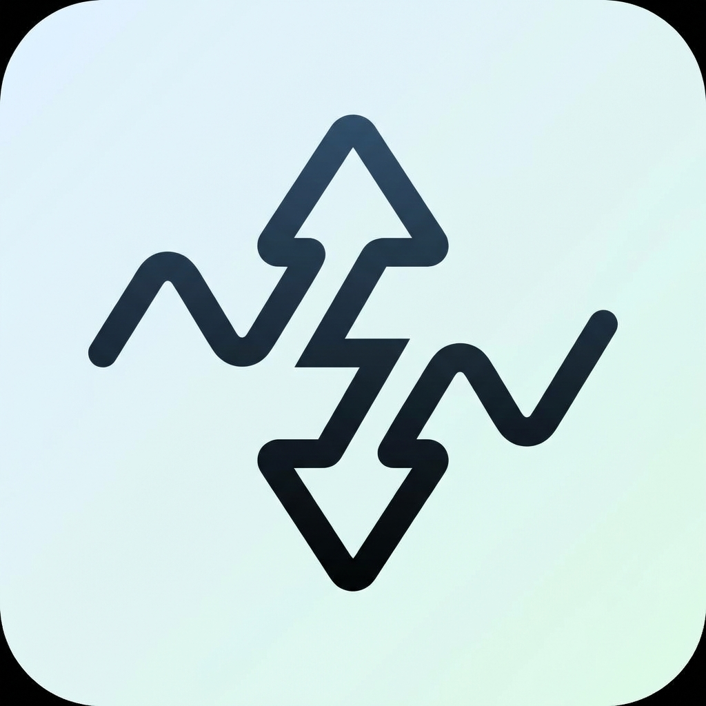

# NetSpeed ⚡️

[](https://github.com/kiransbaliga/NetSpeed)
[](https://github.com/kiransbaliga/NetSpeed)
[](https://opensource.org/licenses/MIT)


**NetSpeed** is a minimal, open-source macOS menu bar app that monitors your network speed in real-time. Written in pure Swift, it's designed to be ultra-lightweight, resource-efficient, and unobtrusive.

<p align="center">
  
</p>

## 🚀 Features

- **Real-time Monitoring**: Displays live upload (↑) and download (↓) speeds.
- **Auto-Scaling Units**: Automatically switches between KB/s, MB/s, and GB/s.
- **Ultra Lightweight**: Compiled binary is only ~64KB. Uses negligible CPU and RAM.
- **Native Implementation**: Written in Swift using low-level system APIs (`getifaddrs`). No external frameworks or dependencies.
- **Unobtrusive**: Lives quietly in your menu bar. No Dock icon.
- **Auto-Start**: Includes a simple script to run at login.

## 🚀 Installation

### Option 1: Download App (Recommended)
1. Go to the [Releases](https://github.com/kiransbaliga/NetSpeed/releases) page.
2. Download the latest `NetSpeed.zip`.
3. Unzip and move `NetSpeed.app` to your `Applications` folder.
4. Launch the app.

### Option 2: Build from Source
```bash
# Clone the repository
git clone https://github.com/kiransbaliga/NetSpeed.git
cd NetSpeed

# Build the app and install to ~/Applications
bash build.sh

# Generate and install the app icon (requires sips)
bash create_icon.sh
```

## 🛠 Usage

- The app sits in your menu bar showing: `↑ 0 KB/s  ↓ 0 KB/s`
- Speeds update every 2 seconds.
- Click the metrics to access the **Quit** option.

## 🗑 Uninstalling

If you used the install script:
```bash
launchctl unload ~/Library/LaunchAgents/com.local.netspeed.plist
rm -rf ~/Applications/NetSpeed.app
rm ~/Library/LaunchAgents/com.local.netspeed.plist
```

## 📄 License

This project is open source and available under the [MIT License](LICENSE).

---
*Keywords: macOS network monitor, internet speed menu bar, bandwidth monitor mac, swift network speed, open source mac app, lightweight network meter, menu bar internet speed, minimal mac app, swift implementation.*
